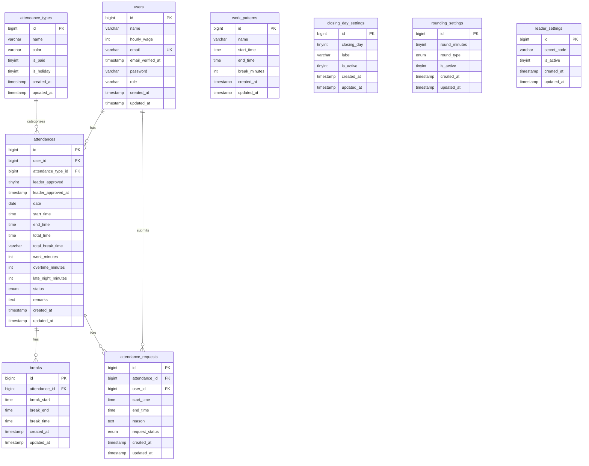

# AttendTrack - 勤怠管理アプリ

## アプリURL
https://attendance.k-ichiki.com

## 使用技術
- PHP 8.3 / Laravel 8
- MySQL 8.0
- Docker / Docker Compose
- Nginx

## 機能一覧

### ユーザー機能
- 会員登録・ログイン（メール認証）
- 出勤・退勤打刻（リアルタイム）
- 休憩開始・終了記録
- 勤怠区分・勤務パターン選択
- 勤怠履歴の閲覧（月次一覧）
- 勤怠データの修正申請
- 申請一覧の確認（承認待ち／承認済み）

### 管理者機能
- スタッフ一覧・時給管理
- 締め日設定（15日・20日・末日など）
- 丸め処理設定（1/5/10/15/30分・自由設定）
- 勤務パターン登録（シフト自動入力補助）
- 勤怠区分登録（欠勤・有給・休日出勤など）
- 現場リーダー承認（シークレット番号による承認）
- 代理入力（管理者がスタッフ分を入力）
- 締め日ごとの集計・修正時メール通知
- PDF出力・請求書メール送信
- 月別勤怠データのCSV出力

## こだわりポイント
- 深夜・残業・休日出勤・60時間超残業の自動計算
- 締め日・丸め処理を管理者が自由にカスタマイズ可能
- 勤務パターン登録でシフト自動入力補助（2交代・3交代対応）
- 現場リーダーによる多段階承認フロー
- 締め日ごとの集計・修正時に関係者へメール通知
- PDF出力・請求書メール送信の自動化
- 代理入力で管理者がスタッフ分を柔軟に対応
- レスポンシブ対応・ハンバーガーメニュー（スマホ重視）

## ER図


```mermaid
erDiagram
    users {
        bigint id PK
        varchar name
        int hourly_wage
        varchar email UK
        timestamp email_verified_at
        varchar password
        varchar role
        timestamp created_at
        timestamp updated_at
    }

    attendances {
        bigint id PK
        bigint user_id FK
        bigint attendance_type_id FK
        tinyint leader_approved
        timestamp leader_approved_at
        date date
        time start_time
        time end_time
        time total_time
        varchar total_break_time
        int work_minutes
        int overtime_minutes
        int late_night_minutes
        enum status
        text remarks
        timestamp created_at
        timestamp updated_at
    }

    breaks {
        bigint id PK
        bigint attendance_id FK
        time break_start
        time break_end
        time break_time
        timestamp created_at
        timestamp updated_at
    }

    attendance_requests {
        bigint id PK
        bigint attendance_id FK
        bigint user_id FK
        time start_time
        time end_time
        text reason
        enum request_status
        timestamp created_at
        timestamp updated_at
    }

    attendance_types {
        bigint id PK
        varchar name
        varchar color
        tinyint is_paid
        tinyint is_holiday
        timestamp created_at
        timestamp updated_at
    }

    work_patterns {
        bigint id PK
        varchar name
        time start_time
        time end_time
        int break_minutes
        timestamp created_at
        timestamp updated_at
    }

    closing_day_settings {
        bigint id PK
        tinyint closing_day
        varchar label
        tinyint is_active
        timestamp created_at
        timestamp updated_at
    }

    rounding_settings {
        bigint id PK
        tinyint round_minutes
        enum round_type
        tinyint is_active
        timestamp created_at
        timestamp updated_at
    }

    leader_settings {
        bigint id PK
        varchar secret_code
        tinyint is_active
        timestamp created_at
        timestamp updated_at
    }

    users ||--o{ attendances : "has"
    users ||--o{ attendance_requests : "submits"
    attendances ||--o{ breaks : "has"
    attendances ||--o{ attendance_requests : "has"
    attendance_types ||--o{ attendances : "categorizes"
```

## テストアカウント
| 役割 | メールアドレス | パスワード |
|------|--------------|----------|
| 管理者 | admin@example.com | password123 |
| 一般ユーザー | user@example.com | password |

## ローカル環境構築

**Dockerビルド**
1. `git clone git@github.com:ichiki925/attendance-app.git`
2. DockerDesktopを起動
3. `docker-compose up -d --build`

**Laravel環境構築**
1. `docker-compose exec php bash`
2. `composer install`
3. `.env.example` を `.env` にコピー
4. `.env` に以下を追加

```text
DB_CONNECTION=mysql
DB_HOST=mysql
DB_PORT=3306
DB_DATABASE=laravel_db
DB_USERNAME=laravel_user
DB_PASSWORD=laravel_pass
```

5. `php artisan key:generate`
6. `php artisan migrate --seed`

**アクセス先**
- アプリ: http://localhost/
- phpMyAdmin: http://localhost:8080/

## CSV出力について
管理者はスタッフの勤怠データをCSV形式でダウンロードできます。

- **デフォルト** → UTF-8
- **Shift-JIS出力** → Shiftキーを押しながら「CSV出力」をクリック（Windows Excelの文字化け対策）