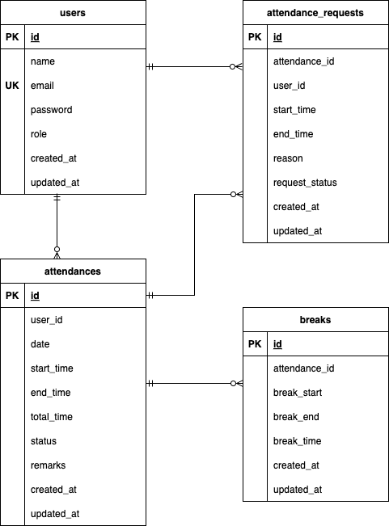

# 勤怠app

## 環境構築
**Dockerビルド**
1. `git clone git@github.com:ichiki925/attendance-app.git`
2. DockerDesktopアプリを立ち上げる
3. `docker-compose up -d --build`

**Laravel環境構築**
1. `docker-compose exec php bash`
2. `composer install`
3. 「.env.example」ファイルを 「.env」ファイルに命名を変更。または、新しく.envファイルを作成
4. .envに以下の環境変数を追加
``` text
DB_CONNECTION=mysql
DB_HOST=mysql
DB_PORT=3306
DB_DATABASE=laravel_db
DB_USERNAME=laravel_user
DB_PASSWORD=laravel_pass
```

5. アプリケーションキーの作成
``` bash
php artisan key:generate
```
6. .env.testingファイルを作成
7. .env.testingに以下の環境変数を追加
``` text
DB_CONNECTION=mysql
DB_HOST=mysql
DB_PORT=3306
DB_DATABASE=test_database
DB_USERNAME=root
DB_PASSWORD=root
```
8. アプリケーションキーの作成
``` bash
php artisan key:generate --env=testing
```
9. マイグレーションの実行
``` bash
php artisan migrate
```
10. シーディングの実行
``` bash
php artisan db:seed
```

## CSV出力機能について

管理者はスタッフの勤怠データをCSV形式でダウンロードできます。

- **デフォルトのエンコーディング** → UTF-8
- **Shift-JISで出力したい場合** → Shiftキーを押しながら「CSV出力」ボタンをクリック

Windows の Excel で開く場合、Shift-JISを選択すると文字化けを防げます。


## テストアカウント
name: 管理者
email: admin@example.com
password: password123
-------------------------
name: 一般ユーザー
email: user@example.com
password: password
-------------------------


## PHPUnitを利用したテストについて
以下のコマンド:
```
docker-compose exec php bash
php artisan migrate:fresh --env=testing
./vendor/bin/phpunit
```


## 使用技術(実行環境)
- PHP8.3.0
- Laravel8.83.27
- MySQL8.0

## ER図



## URL
- 開発環境：http://localhost/
- phpMyAdmin:：http://localhost:8080/
